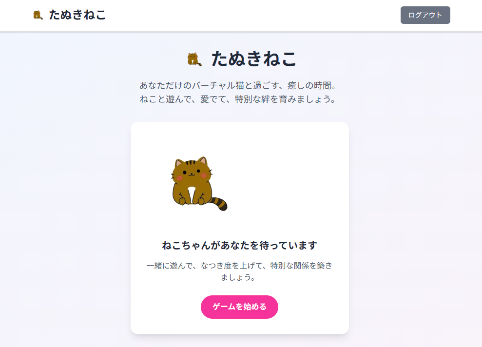
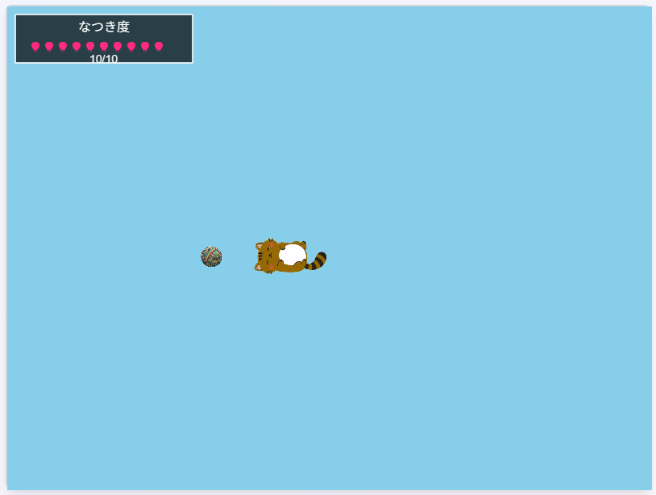

# たぬきねこ

バーチャル猫との癒しの時間を楽しむWebゲームアプリケーション
[playはこちら](https://main.dgcstwg5n9o6c.amplifyapp.com)

[English README](./README_EN.md)



## プロジェクト概要

「たぬきねこ」は、ペットを飼えない人々に癒しと疑似飼育体験を提供するバーチャル猫ゲームです。AI搭載の猫と遊び、愛でて、特別な絆を育むことができます。

### 主な機能

- **おもちゃで遊ぶ** - 様々なおもちゃを使って猫と遊ぶ
- **なつき度システム** - 猫との絆を深めるシステム
- **ねこAI学習** - 猫があなたとの関わりから学習し、行動が変化（プロトタイプでは簡易版のみ）



### リリース履歴
- 2025年9月21日: プロトタイプ版公開
  - [プレスリリース](./docs/press_release_prototype.md)
  - GitHubタグ: [v0.1.0](https://github.com/nekoneko02/cat_game/releases/tag/v0.1.0)

## 技術スタック

- **フレームワーク**: Next.js 15.5.2
- **ゲームエンジン**: Phaser 3.90.0
- **UI**: React 19.1.0 + TailwindCSS 4
- **セッション管理**: iron-session 8.0.4
- **型安全性**: TypeScript 5
- **開発環境**: Turbopack対応

## アーキテクチャ

本プロジェクトは3層構成のアーキテクチャを採用しています：

```
Next.js (アプリケーション層)
├── 画面遷移・ルーティング
├── API呼び出し・セッション管理
└── 内部状態の永続化

Phaser (ゲーム実行層)
├── 描画・入力処理
├── ゲームロジック実行
└── ステートレス設計

共通モジュール (インフラ層)
├── ApiClient (APIラッパー)
├── GameManager (Phaserラッパー)
└── 各種ユーティリティ
```

## セットアップ

### 前提条件

- Node.js 18.0以上
- npm または yarn

### インストール

```bash
# リポジトリをクローン
git clone https://github.com/nekoneko02/cat_game.git
cd cat_game

# 依存関係をインストール
npm install

# 開発サーバーを起動
npm run dev
```

開発サーバーが起動したら、[http://localhost:3000](http://localhost:3000) でアプリケーションにアクセスできます。

### 利用可能なスクリプト

```bash
# 開発サーバー起動（Turbopack使用）
npm run dev

# プロダクションビルド（Turbopack使用）
npm run build

# プロダクションサーバー起動
npm run start

# ESLintによるコード検査
npm run lint
```

## ゲームの遊び方

1. **アカウント作成**: 初回アクセス時にユーザー名と猫の名前を設定
2. **ホーム画面**: 猫の状態を確認し、遊ぶ準備をする
3. **ゲームプレイ**: アナログスティックで移動し、猫と触れ合う
4. **絆を深める**: 一緒に過ごすことで猫との「なつき度」が上昇

## 開発ガイドライン

本プロジェクトでは以下の設計原則に従って開発されています：

### 時間ベースの状態更新
- FPS非依存の実装
- 1秒あたりの変化量で状態を定義
- 実時間ではなくゲーム内時間を使用

### ドメイン駆動設計
- ドメインモデルに基づいた構造
- ビジネスロジックはドメインオブジェクト内に配置
- 明確な責務分離

### セッション管理
- iron-sessionによる暗号化されたCookie
- ユーザー名と猫の内部状態のみを保存
- プライバシーを重視した設計

### 商用リリース品質
- 意味のあるコメントのみを保持
- 適切なエラーハンドリング
- セキュリティベストプラクティスの遵守

詳細な開発規約については [DEVELOPMENT_GUIDELINES.md](./DEVELOPMENT_GUIDELINES.md) を参照してください。

## ねこAIシステム

猫は以下の要素で構成された高度なAIシステムを搭載しています：

### 感情システム
- **快適度**: 猫の気分（-1: 不快 ～ 1: 快適）
- **覚醒度**: 活動レベル（-1: 眠い ～ 1: 元気）
- **安全安心度**: 環境への安心感（-1: 不安 ～ 1: 安心）
- **親和性**: ユーザーとの親密度（-1: 嫌悪 ～ 1: 親愛）

### 学習機能
- セッション毎に猫の行動が進化

## ライセンス

このプロジェクトは開発中のため、現在ライセンスは未定です。

## 貢献

プロジェクトへの貢献を歓迎します。以下の手順でお願いします：

1. プロジェクトをフォーク
2. 機能ブランチを作成 (`git checkout -b feature/amazing-feature`)
3. 変更をコミット (`git commit -m 'Add amazing feature'`)
4. ブランチにプッシュ (`git push origin feature/amazing-feature`)
5. プルリクエストを作成

## 開発状況

現在はスコープ1（基本機能）の開発段階です：
- ✅ 基本的なゲームエンジン実装
- ✅ セッション管理システム
- ✅ ねこAI基本システム
- 🚧 UI/UXの改善
- 🚧 パフォーマンス最適化

---

*「たぬきねこ」で、あなただけの特別な猫との時間をお楽しみください。*
