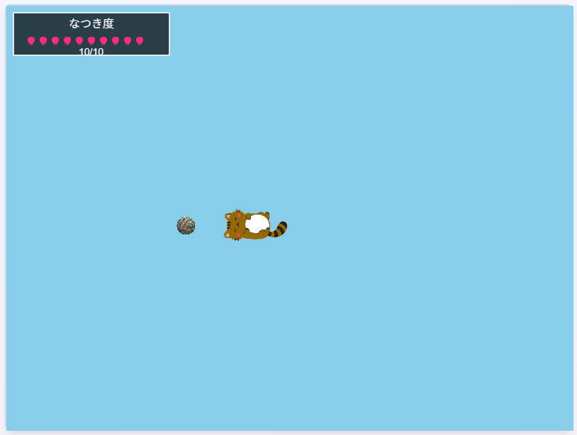

# Tanuki Neko

A healing web game application to enjoy time with virtual cats
[Play here](https://main.dgcstwg5n9o6c.amplifyapp.com)

English README | [日本語 README](./README.md)


## Project Overview

"Tanuki Neko" is a virtual cat game that provides healing and pseudo pet-raising experiences for people who cannot keep pets. You can play with AI-powered cats, love them, and build special bonds.

### Main Features

- **Play with Toys** - Play with cats using various toys
- **Bonding System** - A system to deepen bonds with cats
- **Cat AI Learning** - Cats learn from their interactions with you and their behavior changes (simplified version in prototype only)



### Release History
- September 21, 2025: Prototype version released
  - [Press Release](./docs/press_release_prototype.md)
  - GitHub Tag: [v0.1.0](https://github.com/nekoneko02/cat_game/releases/tag/v0.1.0)

## Technology Stack

- **Framework**: Next.js 15.5.2
- **Game Engine**: Phaser 3.90.0
- **UI**: React 19.1.0 + TailwindCSS 4
- **Session Management**: iron-session 8.0.4
- **Type Safety**: TypeScript 5
- **Development Environment**: Turbopack support

## Architecture

This project adopts a 3-layer architecture:

```
Next.js (Application Layer)
├── Screen transitions & routing
├── API calls & session management
└── Internal state persistence

Phaser (Game Execution Layer)
├── Rendering & input processing
├── Game logic execution
└── Stateless design

Common Modules (Infrastructure Layer)
├── ApiClient (API wrapper)
├── GameManager (Phaser wrapper)
└── Various utilities
```

## Setup

### Prerequisites

- Node.js 18.0 or higher
- npm or yarn

### Installation

```bash
# Clone the repository
git clone https://github.com/nekoneko02/cat_game.git
cd cat_game

# Install dependencies
npm install

# Start development server
npm run dev
```

Once the development server starts, you can access the application at [http://localhost:3000](http://localhost:3000).

### Available Scripts

```bash
# Start development server (using Turbopack)
npm run dev

# Production build (using Turbopack)
npm run build

# Start production server
npm run start

# Code inspection with ESLint
npm run lint
```

## How to Play

1. **Create Account**: Set username and cat name on first access
2. **Home Screen**: Check cat status and prepare to play
3. **Gameplay**: Move with analog stick and interact with the cat
4. **Deepen Bonds**: Spending time together increases "bonding level" with the cat

## Development Guidelines

This project is developed following these design principles:

### Time-based State Updates
- FPS-independent implementation
- State defined by amount of change per second
- Uses game time instead of real time

### Domain-Driven Design
- Structure based on domain models
- Business logic placed within domain objects
- Clear separation of responsibilities

### Session Management
- Encrypted cookies with iron-session
- Stores only username and cat's internal state
- Privacy-focused design

### Commercial Release Quality
- Retains only meaningful comments
- Proper error handling
- Adherence to security best practices

For detailed development conventions, refer to [DEVELOPMENT_GUIDELINES.md](./DEVELOPMENT_GUIDELINES.md).

## Cat AI System

The cat is equipped with an advanced AI system composed of the following elements:

### Emotion System
- **Comfort**: Cat's mood (-1: uncomfortable ～ 1: comfortable)
- **Arousal**: Activity level (-1: sleepy ～ 1: energetic)
- **Safety**: Sense of security in environment (-1: anxious ～ 1: secure)
- **Affinity**: Intimacy with user (-1: aversion ～ 1: affection)

### Learning Features
- Cat behavior evolves with each session

## License

This project is under development and the license is currently undetermined.

## Contributing

We welcome contributions to the project. Please follow these steps:

1. Fork the project
2. Create a feature branch (`git checkout -b feature/amazing-feature`)
3. Commit your changes (`git commit -m 'Add amazing feature'`)
4. Push to the branch (`git push origin feature/amazing-feature`)
5. Create a Pull Request

## Development Status

Currently in Scope 1 (basic features) development phase:
- ✅ Basic game engine implementation
- ✅ Session management system
- ✅ Basic cat AI system
- 🚧 UI/UX improvements
- 🚧 Performance optimization

---

*Enjoy your special time with your unique cat in "Tanuki Neko".*